

	

<h1 align="center">
	minification benchmarks
</h1>

> What's the best JavaScript minifier?

This project benchmarks the following minifiers:

<!-- minifiers:start -->
- [esbuild](https://github.com/evanw/esbuild) v0.24.2
- [oxc-minify](https://github.com/oxc-project/oxc.git) v0.48.2
- [@swc/core](https://github.com/swc-project/swc) v1.10.9
- [@tdewolff/minify](https://github.com/tdewolff/minify#readme) v2.21.3
- [terser](https://github.com/terser/terser) v5.37.0
<!-- minifiers:end -->

_Benchmarks last updated on <!-- lastUpdated:start -->Feb 2, 2025<!-- lastUpdated:end -->._

 

	
	

## 🙋‍♂️ Why?

1. To help you pick a minifier that fits your needs
2. To promote JS minifiers and document their performances
3. To encourage healthy competition and improvement amongst minifiers

## 👟 Methodology

- Each minifier is executed in its own process with a 10s timeout
- Artifact integrity is verified by a test before and after minification
- Minifier upgrade PRs are automated via [WhiteSource Renovate](https://www.whitesourcesoftware.com/free-developer-tools/renovate/)
- Benchmarks are updated on every PR via [GitHub Actions](https://github.com/privatenumber/minification-benchmarks/actions/workflows/benchmark.yml)

## ⏱ Metrics

Minifiers are ranked by smallest minzipped size.

#### Minified size

Size of the minified output.

#### Minzipped size

Size of the minified output with [Gzip compression](https://en.wikipedia.org/wiki/Gzip).

For minifiers, this measures how compressable the output is.

For users, this measures network transfer size, which is usually the metric that matters most.

#### Time

How long minification took (average of 5 runs). Each time is annotated with a multiplier relative to the fastest minifier.

## 📋 Results

<!-- benchmarks:start -->
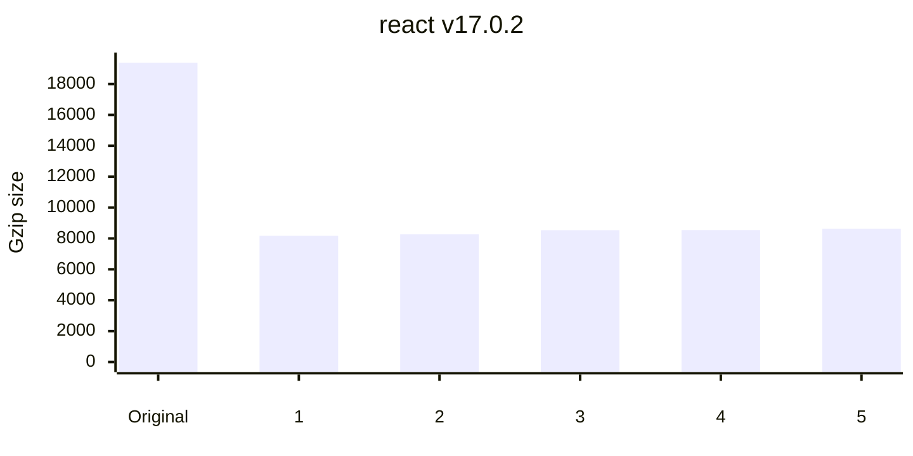

| Artifact                                                                                                                          |                    Original size |                       Gzip size |                          |
| :-------------------------------------------------------------------------------------------------------------------------------- | -------------------------------: | ------------------------------: | -----------------------: |
| [react v17.0.2](https://www.npmjs.com/package/react/v/17.0.2) ([Source](https://unpkg.com/react@17.0.2/cjs/react.development.js)) |                       `72.13 kB` |                      `19.39 kB` |                          |
| **Minifier**                                                                                                                      |                **Minified size** |              **Minzipped size** |                 **Time** |
| 1. [@swc/core](packages/minifiers/minifiers/swc.ts)                                                                               | **🏆-68% `22.87 kB`** | **🏆-58% `8.17 kB`** |   *8x* `9 ms` |
| 2. [terser](packages/minifiers/minifiers/terser.ts)                                                                               |       -68% `23.07 kB` |       -57% `8.27 kB` | *84x* `99 ms` |
| 3. [oxc-minify](packages/minifiers/minifiers/oxc.ts)                                                                              |       -67% `23.59 kB` |       -56% `8.53 kB` |   *1x* `1 ms` |
| 4. [esbuild](packages/minifiers/minifiers/esbuild.ts)                                                                             |       -67% `23.70 kB` |       -56% `8.54 kB` | *28x* `33 ms` |
| 5. [@tdewolff/minify](packages/minifiers/minifiers/tdewolff-minify.ts)                                                            |       -67% `23.53 kB` |       -55% `8.63 kB` | **🏆 `1 ms`** |

----

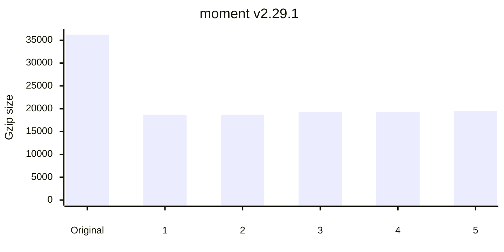

| Artifact                                                                                                              |                    Original size |                        Gzip size |                           |
| :-------------------------------------------------------------------------------------------------------------------- | -------------------------------: | -------------------------------: | ------------------------: |
| [moment v2.29.1](https://www.npmjs.com/package/moment/v/2.29.1) ([Source](https://unpkg.com/moment@2.29.1/moment.js)) |                      `173.90 kB` |                       `36.23 kB` |                           |
| **Minifier**                                                                                                          |                **Minified size** |               **Minzipped size** |                  **Time** |
| 1. [@swc/core](packages/minifiers/minifiers/swc.ts)                                                                   | **🏆-67% `58.21 kB`** | **🏆-48% `18.69 kB`** |   *9x* `23 ms` |
| 2. [terser](packages/minifiers/minifiers/terser.ts)                                                                   |       -66% `59.14 kB` |       -48% `18.69 kB` | *88x* `221 ms` |
| 3. [oxc-minify](packages/minifiers/minifiers/oxc.ts)                                                                  |       -66% `59.55 kB` |       -47% `19.27 kB` |    *1x* `4 ms` |
| 4. [esbuild](packages/minifiers/minifiers/esbuild.ts)                                                                 |       -66% `59.82 kB` |       -47% `19.33 kB` |   *4x* `12 ms` |
| 5. [@tdewolff/minify](packages/minifiers/minifiers/tdewolff-minify.ts)                                                |       -66% `59.95 kB` |       -46% `19.50 kB` |  **🏆 `3 ms`** |

----

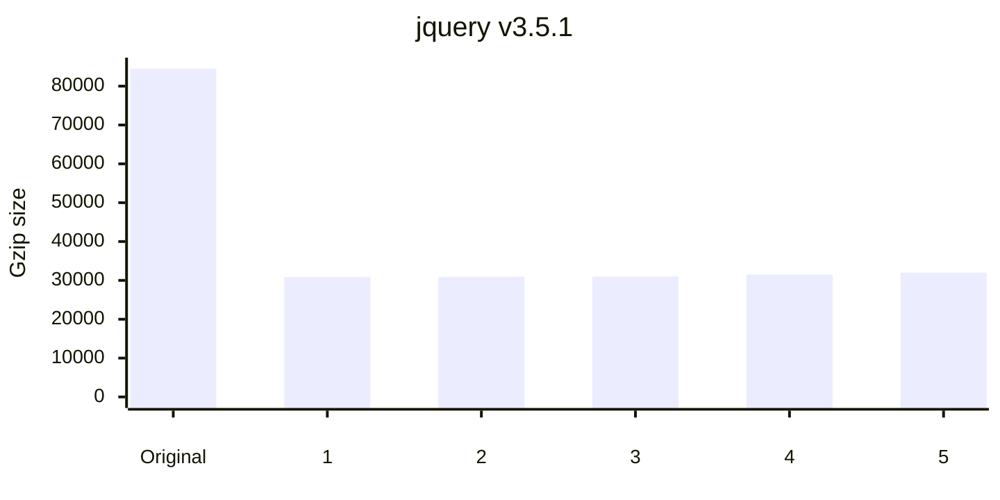

| Artifact                                                                                                                |                    Original size |                        Gzip size |                           |
| :---------------------------------------------------------------------------------------------------------------------- | -------------------------------: | -------------------------------: | ------------------------: |
| [jquery v3.5.1](https://www.npmjs.com/package/jquery/v/3.5.1) ([Source](https://unpkg.com/jquery@3.5.1/dist/jquery.js)) |                      `287.63 kB` |                       `84.50 kB` |                           |
| **Minifier**                                                                                                            |                **Minified size** |               **Minzipped size** |                  **Time** |
| 1. [@swc/core](packages/minifiers/minifiers/swc.ts)                                                                     | **🏆-69% `89.15 kB`** | **🏆-63% `30.87 kB`** |   *9x* `40 ms` |
| 2. [terser](packages/minifiers/minifiers/terser.ts)                                                                     |       -69% `89.54 kB` |       -63% `30.91 kB` | *69x* `289 ms` |
| 3. [oxc-minify](packages/minifiers/minifiers/oxc.ts)                                                                    |       -69% `89.48 kB` |       -63% `30.98 kB` |    *1x* `6 ms` |
| 4. [@tdewolff/minify](packages/minifiers/minifiers/tdewolff-minify.ts)                                                  |       -69% `89.85 kB` |       -63% `31.47 kB` |  **🏆 `4 ms`** |
| 5. [esbuild](packages/minifiers/minifiers/esbuild.ts)                                                                   |       -69% `90.07 kB` |       -62% `31.95 kB` |   *4x* `19 ms` |

----

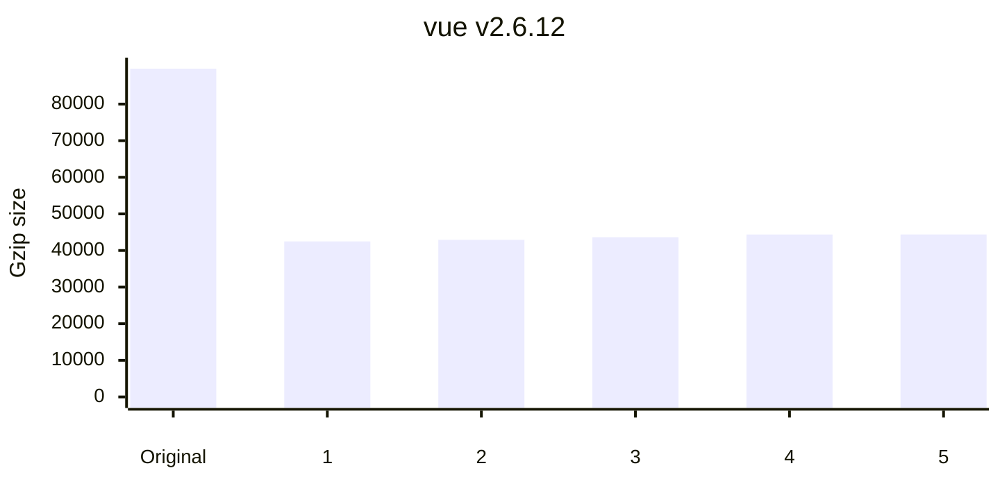

| Artifact                                                                                                       |                     Original size |                        Gzip size |                           |
| :------------------------------------------------------------------------------------------------------------- | --------------------------------: | -------------------------------: | ------------------------: |
| [vue v2.6.12](https://www.npmjs.com/package/vue/v/2.6.12) ([Source](https://unpkg.com/vue@2.6.12/dist/vue.js)) |                       `342.15 kB` |                       `89.67 kB` |                           |
| **Minifier**                                                                                                   |                 **Minified size** |               **Minzipped size** |                  **Time** |
| 1. [@swc/core](packages/minifiers/minifiers/swc.ts)                                                            | **🏆-66% `115.48 kB`** | **🏆-53% `42.49 kB`** |   *8x* `54 ms` |
| 2. [terser](packages/minifiers/minifiers/terser.ts)                                                            |       -66% `116.80 kB` |       -52% `42.92 kB` | *53x* `358 ms` |
| 3. [oxc-minify](packages/minifiers/minifiers/oxc.ts)                                                           |       -66% `117.68 kB` |       -51% `43.63 kB` |    *1x* `7 ms` |
| 4. [esbuild](packages/minifiers/minifiers/esbuild.ts)                                                          |       -65% `118.14 kB` |       -51% `44.37 kB` |   *3x* `21 ms` |
| 5. [@tdewolff/minify](packages/minifiers/minifiers/tdewolff-minify.ts)                                         |       -66% `117.81 kB` |       -51% `44.38 kB` |  **🏆 `7 ms`** |

----

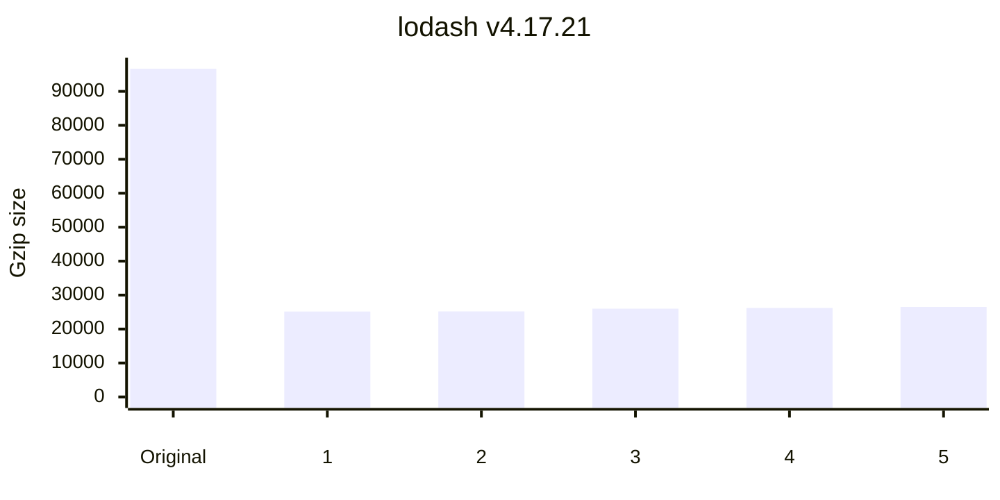

| Artifact                                                                                                                 |                    Original size |                        Gzip size |                           |
| :----------------------------------------------------------------------------------------------------------------------- | -------------------------------: | -------------------------------: | ------------------------: |
| [lodash v4.17.21](https://www.npmjs.com/package/lodash/v/4.17.21) ([Source](https://unpkg.com/lodash@4.17.21/lodash.js)) |                      `544.09 kB` |                       `96.69 kB` |                           |
| **Minifier**                                                                                                             |                **Minified size** |               **Minzipped size** |                  **Time** |
| 1. [@swc/core](packages/minifiers/minifiers/swc.ts)                                                                      | **🏆-87% `69.83 kB`** | **🏆-74% `25.15 kB`** |   *9x* `49 ms` |
| 2. [terser](packages/minifiers/minifiers/terser.ts)                                                                      |       -87% `70.67 kB` |       -74% `25.19 kB` | *58x* `307 ms` |
| 3. [oxc-minify](packages/minifiers/minifiers/oxc.ts)                                                                     |       -87% `71.43 kB` |       -73% `25.99 kB` |  **🏆 `5 ms`** |
| 4. [esbuild](packages/minifiers/minifiers/esbuild.ts)                                                                    |       -87% `72.48 kB` |       -73% `26.20 kB` |   *3x* `18 ms` |
| 5. [@tdewolff/minify](packages/minifiers/minifiers/tdewolff-minify.ts)                                                   |       -87% `71.90 kB` |       -73% `26.50 kB` |    *1x* `6 ms` |

----

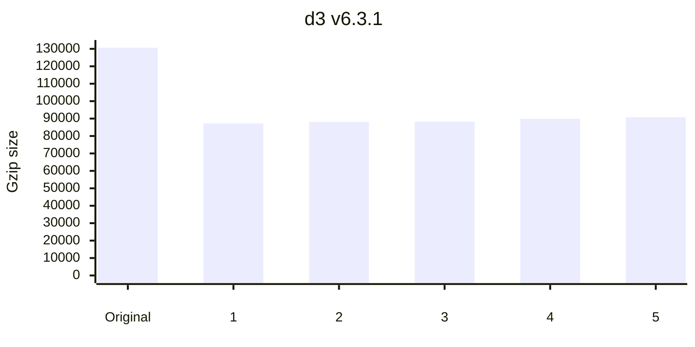

| Artifact                                                                                                |                     Original size |                        Gzip size |                           |
| :------------------------------------------------------------------------------------------------------ | --------------------------------: | -------------------------------: | ------------------------: |
| [d3 v6.3.1](https://www.npmjs.com/package/d3/v/6.3.1) ([Source](https://unpkg.com/d3@6.3.1/dist/d3.js)) |                       `555.77 kB` |                      `130.69 kB` |                           |
| **Minifier**                                                                                            |                 **Minified size** |               **Minzipped size** |                  **Time** |
| 1. [@swc/core](packages/minifiers/minifiers/swc.ts)                                                     | **🏆-52% `265.26 kB`** | **🏆-33% `87.20 kB`** |  *6x* `118 ms` |
| 2. [terser](packages/minifiers/minifiers/terser.ts)                                                     |       -52% `267.77 kB` |       -33% `88.09 kB` | *45x* `811 ms` |
| 3. [oxc-minify](packages/minifiers/minifiers/oxc.ts)                                                    |       -51% `271.25 kB` |       -32% `88.24 kB` | **🏆 `18 ms`** |
| 4. [@tdewolff/minify](packages/minifiers/minifiers/tdewolff-minify.ts)                                  |       -51% `269.93 kB` |       -31% `89.89 kB` |   *1x* `19 ms` |
| 5. [esbuild](packages/minifiers/minifiers/esbuild.ts)                                                   |       -51% `270.13 kB` |       -31% `90.80 kB` |   *1x* `35 ms` |

----

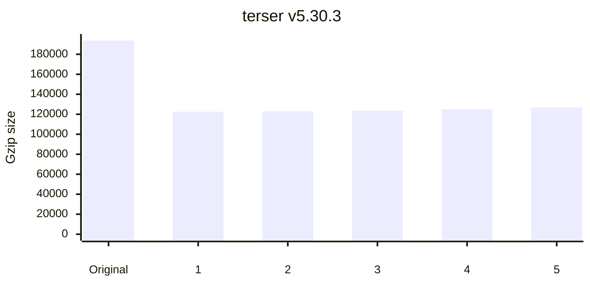

| Artifact                                                                                                                       |                     Original size |                         Gzip size |                           |
| :----------------------------------------------------------------------------------------------------------------------------- | --------------------------------: | --------------------------------: | ------------------------: |
| [terser v5.30.3](https://www.npmjs.com/package/terser/v/5.30.3) ([Source](https://unpkg.com/terser@5.30.3/dist/bundle.min.js)) |                         `1.01 MB` |                       `193.76 kB` |                           |
| **Minifier**                                                                                                                   |                 **Minified size** |                **Minzipped size** |                  **Time** |
| 1. [oxc-minify](packages/minifiers/minifiers/oxc.ts)                                                                           | **🏆-56% `440.97 kB`** | **🏆-37% `122.55 kB`** |   *1x* `19 ms` |
| 2. [@swc/core](packages/minifiers/minifiers/swc.ts)                                                                            |       -55% `455.55 kB` |       -36% `123.07 kB` |  *6x* `109 ms` |
| 3. [terser](packages/minifiers/minifiers/terser.ts)                                                                            |       -55% `458.29 kB` |       -36% `123.48 kB` | *42x* `746 ms` |
| 4. [@tdewolff/minify](packages/minifiers/minifiers/tdewolff-minify.ts)                                                         |       -55% `456.70 kB` |       -36% `124.90 kB` | **🏆 `17 ms`** |
| 5. [esbuild](packages/minifiers/minifiers/esbuild.ts)                                                                          |       -55% `458.89 kB` |       -35% `126.71 kB` |   *2x* `36 ms` |

----

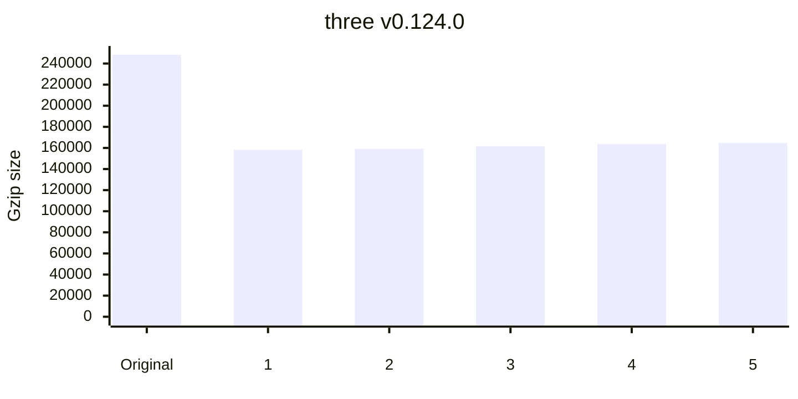

| Artifact                                                                                                                   |                     Original size |                         Gzip size |                             |
| :------------------------------------------------------------------------------------------------------------------------- | --------------------------------: | --------------------------------: | --------------------------: |
| [three v0.124.0](https://www.npmjs.com/package/three/v/0.124.0) ([Source](https://unpkg.com/three@0.124.0/build/three.js)) |                         `1.25 MB` |                       `248.27 kB` |                             |
| **Minifier**                                                                                                               |                 **Minified size** |                **Minzipped size** |                    **Time** |
| 1. [@swc/core](packages/minifiers/minifiers/swc.ts)                                                                        | **🏆-48% `642.89 kB`** | **🏆-36% `158.22 kB`** |    *5x* `157 ms` |
| 2. [terser](packages/minifiers/minifiers/terser.ts)                                                                        |       -48% `653.25 kB` |       -36% `159.20 kB` | *37x* `1,022 ms` |
| 3. [oxc-minify](packages/minifiers/minifiers/oxc.ts)                                                                       |       -48% `650.36 kB` |       -35% `161.59 kB` |     *1x* `28 ms` |
| 4. [esbuild](packages/minifiers/minifiers/esbuild.ts)                                                                      |       -48% `646.76 kB` |       -34% `163.73 kB` |     *1x* `50 ms` |
| 5. [@tdewolff/minify](packages/minifiers/minifiers/tdewolff-minify.ts)                                                     |       -48% `644.55 kB` |       -34% `164.74 kB` |   **🏆 `27 ms`** |

----

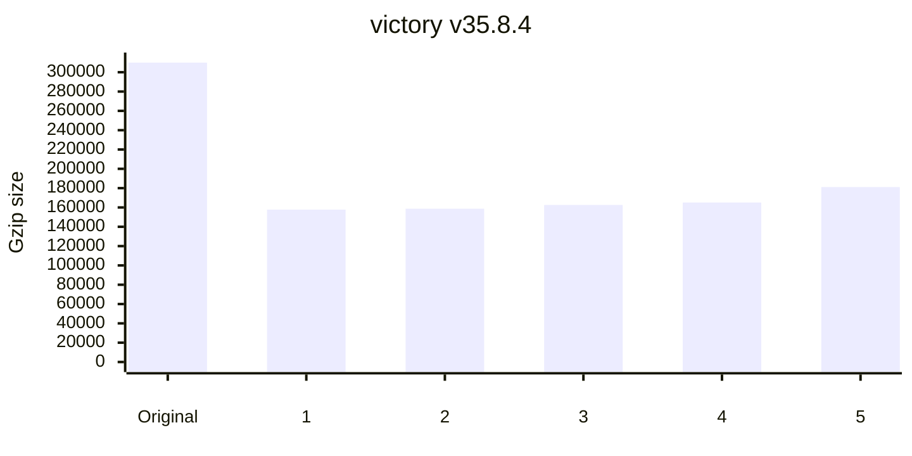

| Artifact                                                                                                                       |                     Original size |                         Gzip size |                             |
| :----------------------------------------------------------------------------------------------------------------------------- | --------------------------------: | --------------------------------: | --------------------------: |
| [victory v35.8.4](https://www.npmjs.com/package/victory/v/35.8.4) ([Source](https://unpkg.com/victory@35.8.4/dist/victory.js)) |                         `2.13 MB` |                       `309.94 kB` |                             |
| **Minifier**                                                                                                                   |                 **Minified size** |                **Minzipped size** |                    **Time** |
| 1. [@swc/core](packages/minifiers/minifiers/swc.ts)                                                                            | **🏆-67% `707.20 kB`** | **🏆-49% `157.80 kB`** |    *7x* `234 ms` |
| 2. [terser](packages/minifiers/minifiers/terser.ts)                                                                            |       -66% `715.58 kB` |       -49% `158.71 kB` | *44x* `1,444 ms` |
| 3. [oxc-minify](packages/minifiers/minifiers/oxc.ts)                                                                           |       -66% `718.69 kB` |       -48% `162.57 kB` |     *1x* `36 ms` |
| 4. [@tdewolff/minify](packages/minifiers/minifiers/tdewolff-minify.ts)                                                         |       -66% `718.73 kB` |       -47% `165.13 kB` |   **🏆 `32 ms`** |
| 5. [esbuild](packages/minifiers/minifiers/esbuild.ts)                                                                          |       -66% `724.14 kB` |       -42% `181.07 kB` |     *2x* `68 ms` |

----

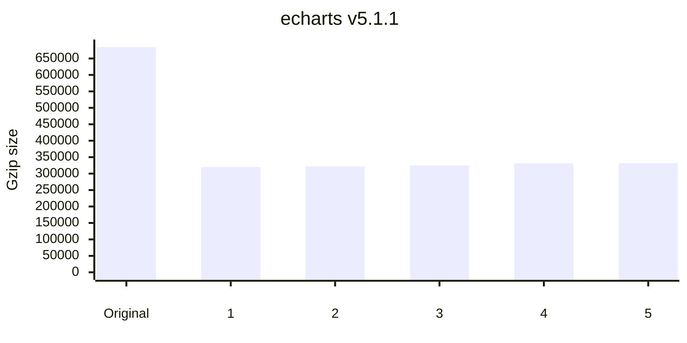

| Artifact                                                                                                                    |                     Original size |                         Gzip size |                             |
| :-------------------------------------------------------------------------------------------------------------------------- | --------------------------------: | --------------------------------: | --------------------------: |
| [echarts v5.1.1](https://www.npmjs.com/package/echarts/v/5.1.1) ([Source](https://unpkg.com/echarts@5.1.1/dist/echarts.js)) |                         `3.20 MB` |                       `684.61 kB` |                             |
| **Minifier**                                                                                                                |                 **Minified size** |                **Minzipped size** |                    **Time** |
| 1. [@swc/core](packages/minifiers/minifiers/swc.ts)                                                                         | **🏆-69% `993.02 kB`** | **🏆-53% `320.19 kB`** |    *6x* `427 ms` |
| 2. [terser](packages/minifiers/minifiers/terser.ts)                                                                         |         -69% `1.00 MB` |       -53% `321.99 kB` | *34x* `2,258 ms` |
| 3. [oxc-minify](packages/minifiers/minifiers/oxc.ts)                                                                        |         -68% `1.01 MB` |       -53% `324.93 kB` |   **🏆 `65 ms`** |
| 4. [esbuild](packages/minifiers/minifiers/esbuild.ts)                                                                       |         -68% `1.01 MB` |       -52% `331.56 kB` |    *1x* `103 ms` |
| 5. [@tdewolff/minify](packages/minifiers/minifiers/tdewolff-minify.ts)                                                      |         -68% `1.01 MB` |       -52% `331.79 kB` |     *1x* `67 ms` |

----

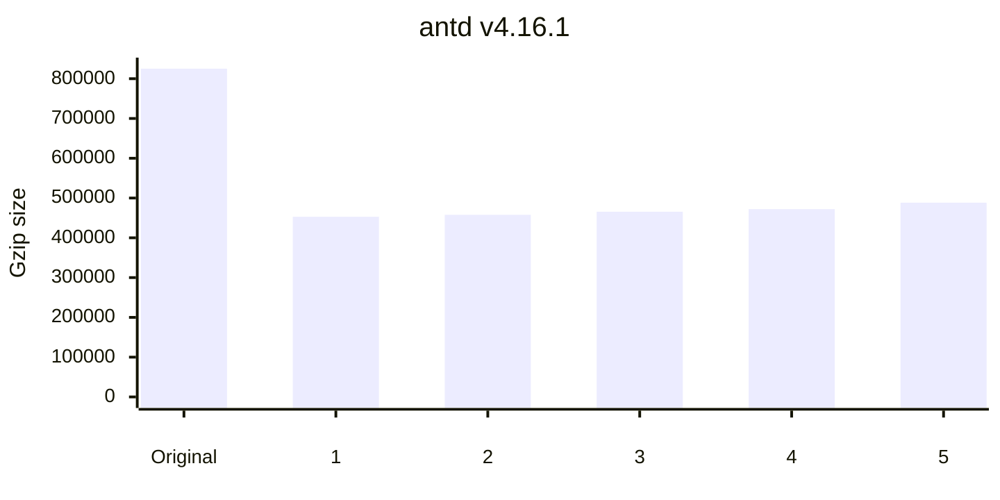

| Artifact                                                                                                           |                   Original size |                         Gzip size |                             |
| :----------------------------------------------------------------------------------------------------------------- | ------------------------------: | --------------------------------: | --------------------------: |
| [antd v4.16.1](https://www.npmjs.com/package/antd/v/4.16.1) ([Source](https://unpkg.com/antd@4.16.1/dist/antd.js)) |                       `6.67 MB` |                       `825.18 kB` |                             |
| **Minifier**                                                                                                       |               **Minified size** |                **Minzipped size** |                    **Time** |
| 1. [@swc/core](packages/minifiers/minifiers/swc.ts)                                                                | **🏆-68% `2.15 MB`** | **🏆-45% `452.86 kB`** |    *7x* `563 ms` |
| 2. [terser](packages/minifiers/minifiers/terser.ts)                                                                |       -66% `2.25 MB` |       -45% `457.79 kB` | *32x* `2,582 ms` |
| 3. [oxc-minify](packages/minifiers/minifiers/oxc.ts)                                                               |       -66% `2.30 MB` |       -44% `465.60 kB` |     *1x* `87 ms` |
| 4. [@tdewolff/minify](packages/minifiers/minifiers/tdewolff-minify.ts)                                             |       -66% `2.30 MB` |       -43% `472.04 kB` |   **🏆 `80 ms`** |
| 5. [esbuild](packages/minifiers/minifiers/esbuild.ts)                                                              |       -65% `2.31 MB` |       -41% `488.28 kB` |    *1x* `152 ms` |

----

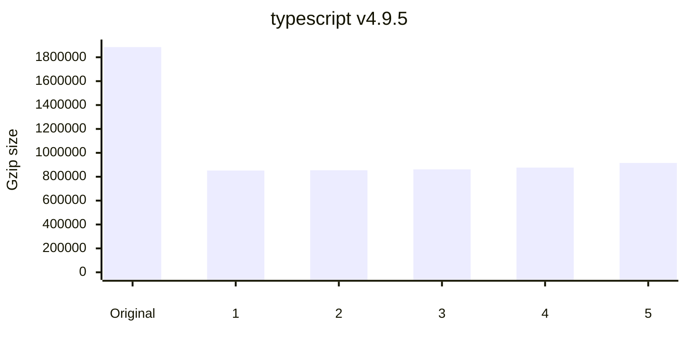

| Artifact                                                                                                                               |                   Original size |                         Gzip size |                             |
| :------------------------------------------------------------------------------------------------------------------------------------- | ------------------------------: | --------------------------------: | --------------------------: |
| [typescript v4.9.5](https://www.npmjs.com/package/typescript/v/4.9.5) ([Source](https://unpkg.com/typescript@4.9.5/lib/typescript.js)) |                      `10.95 MB` |                         `1.88 MB` |                             |
| **Minifier**                                                                                                                           |               **Minified size** |                **Minzipped size** |                    **Time** |
| 1. [@swc/core](packages/minifiers/minifiers/swc.ts)                                                                                    | **🏆-70% `3.31 MB`** | **🏆-55% `851.75 kB`** |  *7x* `1,073 ms` |
| 2. [terser](packages/minifiers/minifiers/terser.ts)                                                                                    |       -69% `3.35 MB` |       -55% `854.21 kB` | *37x* `5,351 ms` |
| 3. [oxc-minify](packages/minifiers/minifiers/oxc.ts)                                                                                   |       -69% `3.36 MB` |       -54% `861.84 kB` |    *1x* `166 ms` |
| 4. [@tdewolff/minify](packages/minifiers/minifiers/tdewolff-minify.ts)                                                                 |       -69% `3.36 MB` |       -53% `876.66 kB` |  **🏆 `142 ms`** |
| 5. [esbuild](packages/minifiers/minifiers/esbuild.ts)                                                                                  |       -68% `3.49 MB` |       -51% `915.50 kB` |    *1x* `253 ms` |

<!-- benchmarks:end -->

## Sponsors

	

